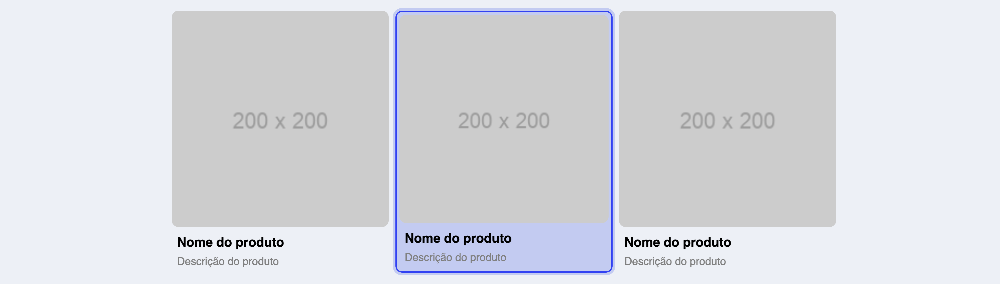

# Exercício Grunt
Esse projeto foi elaborado para o exercicío do módulo Grunt do curso, nele é preciso fazer a compilação do LESS e compressão do JavaScript.

Para exemplificar foi feito um formulário de inscrição para uma Newsletter fictícia, confira o projeto em produção [clicando aqui](https://exercicio-grunt-seven.vercel.app/).